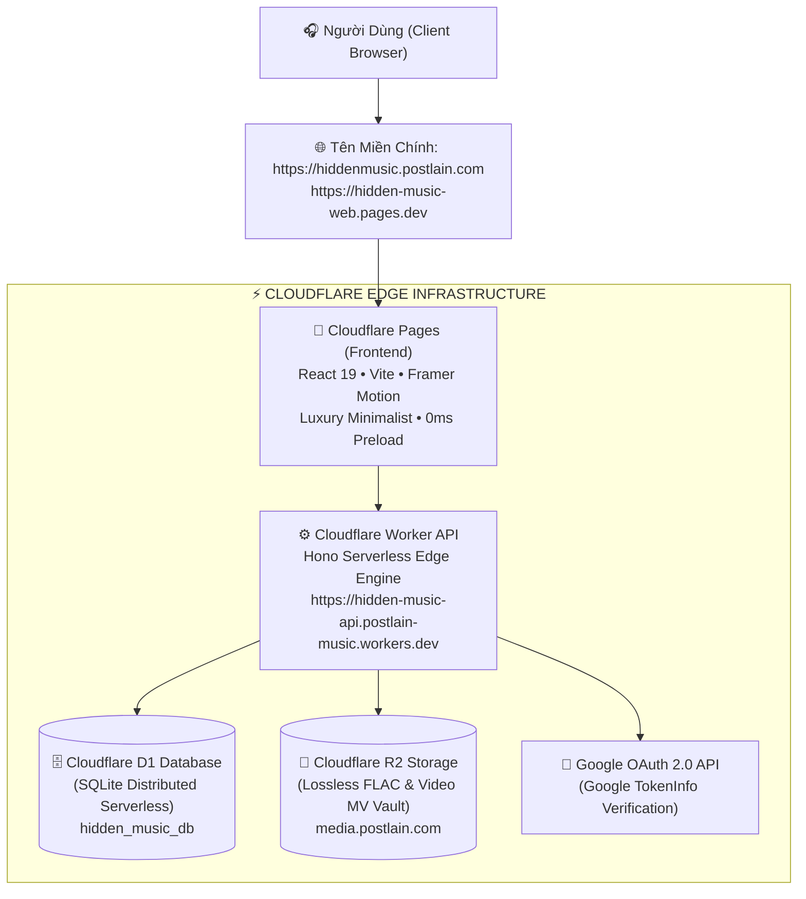

# 🏛️ TỔNG HỢP TOÀN BỘ TIẾN ĐỘ DỰ ÁN HIDDEN MUSIC 2 (NGÀY 28/08/2026)

---

## 📌 1. TỔNG QUAN KIẾN TRÚC HỆ THỐNG MỚI

Dự án **Hidden Music 2** đã được tái cấu trúc hoàn toàn từ phiên bản cũ (Next.js/Supabase) sang mô hình **Cloudflare Edge Monorepo hiện đại**, độc lập 100%, hiệu năng cực cao và bảo mật chuẩn công nghiệp:

---

## 💎 2. CÁC CỘT MỐC ĐÃ HOÀN THÀNH TỪ ĐẦU ĐẾN NAY

### 🔑 2.1. Đăng nhập Google thật 100% (Zero Mock Data)
* **Tách biệt khỏi Supabase:** Xây dựng luồng xác thực độc lập trên Cloudflare D1 và Worker.
* **Google Identity Services (GSI):** Tích hợp trực tiếp Google OAuth Client ID chính thức (`269738854318-95pab6qb8fmjv4q676s3jeu643e7291p.apps.googleusercontent.com`).
* **Bảo mật phía Server:** Endpoint `/api/auth/google` gửi mã `credential` lên máy chủ Google TokenInfo (`https://oauth2.googleapis.com/tokeninfo`) để lấy định danh thật, email thật, avatar thật.
* **Đồng bộ tên miền:** Cấu hình xác thực cho `https://hiddenmusic.postlain.com` và `https://hidden-music-web.pages.dev`.

---

### 🗄️ 2.2. Chuẩn Hóa Cơ Sở Dữ Liệu Cloudflare D1 (`hidden_music_db`)
Loại bỏ các bảng phức tạp không cần thiết, tối ưu mô hình dữ liệu tinh gọn và nhất quán:

1. **Bảng `albums`:**
   * Quản lý thống nhất cho mọi định dạng âm nhạc (**Album**, **Single**, **EP**) thông qua cột `type` (`album` | `single` | `ep`).
   * Đã nạp dữ liệu chính thức của Album **HVL (99%) - MCK** (2023, Melodic Rap / R&B).
2. **Bảng `tracks`:**
   * Đã nạp **đầy đủ 30 bài hát** của Album HVL (99%) kèm đường dẫn **Audio Lossless FLAC**, **Video MV (.mkv)** từ Cloudflare R2, Artwork ảnh bìa và thời lượng từng giây.
3. **Bảng `user_favorites`:**
   * Lưu trữ vĩnh viễn danh sách bài hát yêu thích theo tài khoản Google của người dùng.
   * Đồng bộ API `/api/favorites` và bộ nhớ đệm `localStorage` giúp trạng thái trái tim hiển thị tức thì (0ms).
4. **Bảng `users`:**
   * Quản lý profile người dùng Google (`id`, `google_id`, `email`, `name`, `avatar_url`, `last_login_at`).
5. **Xóa bỏ các bảng thừa:** Đã xóa bỏ hoàn toàn bảng `playlists` và `playlist_tracks`.

---

### 🎨 2.3. Tái Thiết Kế Giao Diện Tối Giản Nghệ Thuật (Luxury Minimalist & Awwwards Motion)
* **Bảng màu đơn sắc sang trọng:** Nền đen sâu `#000000` với hiệu ứng sóng ánh sáng chuyển động **Monochrome Fluid Aurora (20%–30% độ tương phản)** xám bạc và trắng ngọc trai. Loại bỏ hoàn toàn màu tím/hồng neon cũ.
* **Màn hình Gate (Đăng nhập):** Đồng bộ nền đen tuyền, đĩa xoay xám bạc và nút Google kính mờ sang trọng.
* **Navbar Góc-Đến-Góc:** Hoàn toàn trong suốt (loại bỏ hiệu ứng kính mờ và viền xám), góc trái là Icon + Tên, chính giữa là nút chuyển `Vault / Khám phá`, góc phải là Avatar tròn + Nút đăng xuất (bỏ tên user và ô tìm kiếm).
* **Khung hình cố định (Fixed-Viewport 100vh — Zero Scrollbar):**
  * Ẩn 100% thanh cuộn.
  * Chuyển đổi Section mượt mà thông qua con lăn chuột (Wheel), phím mũi tên Lên/Xuống hoặc vuốt cảm ứng (không hiển thị bất kỳ text hướng dẫn nào).
* **Chuyển động độc bản (Choreographed Motion) cho từng Section:**
  * **Section 1:** Bìa Album HVL vuông bo góc trượt sang trái, mở rộng 5 bài hát tiêu biểu xuất hiện so le (Staggered Animation).
  * **Section 2:** Bìa Album 3D Cover Flow ở trung tâm kéo chuột qua lại mượt mà, đồng bộ chính xác với dãy chấm chỉ mục bên dưới.
  * **Section 3:** Nút **"CHUYỂN QUA EXPLORE"** với hiệu ứng phát sáng trắng rực rỡ khi đưa chuột vào.
* **Tối ưu hiển thị ảnh bìa:** Tích hợp thẻ `preload` ưu tiên cao trong `<head>` và tinh chỉnh tỷ lệ vuông `1:1` chuẩn xác, tải ảnh tức thì không bị giật hay mất mood.

---

### 🔒 2.4. Quy Tắc Âm Thanh & Luồng Trải Nghiệm
* **Không tự phát nhạc ở trang chủ:** Toàn bộ trang chủ chỉ phục vụ mục đích trưng bày nghệ thuật thị giác.
* **Kích hoạt nhạc theo không gian 3D:** Âm nhạc chỉ bắt đầu được nạp và giải mã Lossless khi người dùng chính thức bước vào không gian 3D của Album.

---

## 🌐 3. THÔNG TIN TRIỂN KHAI VÀ LIÊN KẾT TRỰC TIẾP

| Thành phần | Địa chỉ Production |
| :--- | :--- |
| **🌐 Website Chính Thức** | [https://hiddenmusic.postlain.com](https://hiddenmusic.postlain.com) |
| **📄 Cloudflare Pages Backup** | [https://hidden-music-web.pages.dev](https://hidden-music-web.pages.dev) |
| **⚙️ Cloudflare Worker API** | [https://hidden-music-api.postlain-music.workers.dev](https://hidden-music-api.postlain-music.workers.dev) |
| **🗄️ Cloudflare D1 Database** | `hidden_music_db` (`bc9d31f0-e706-4f6c-924d-4b6243d9e6c4`) |
| **🎵 Cloudflare R2 Storage** | `hidden-music-vault` (`https://media.postlain.com`) |
| **📦 GitHub Repository** | [https://github.com/postlainmusic/hidden-music-2](https://github.com/postlainmusic/hidden-music-2) |

---
*Báo cáo được tạo tự động và đồng bộ vào mã nguồn dự án ngày 28/08/2026.*
